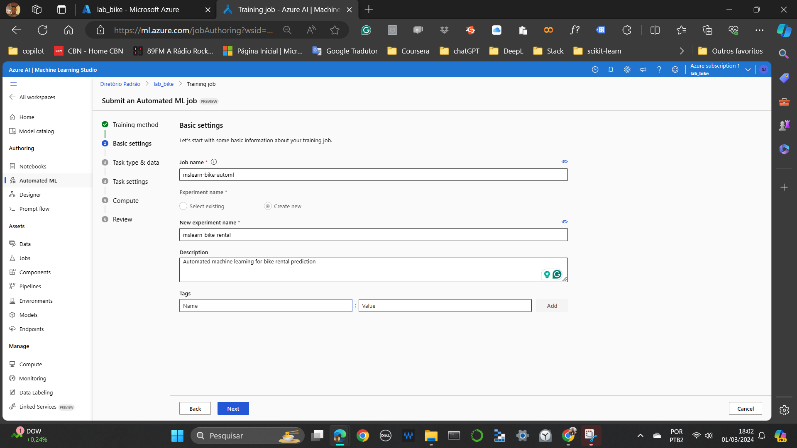
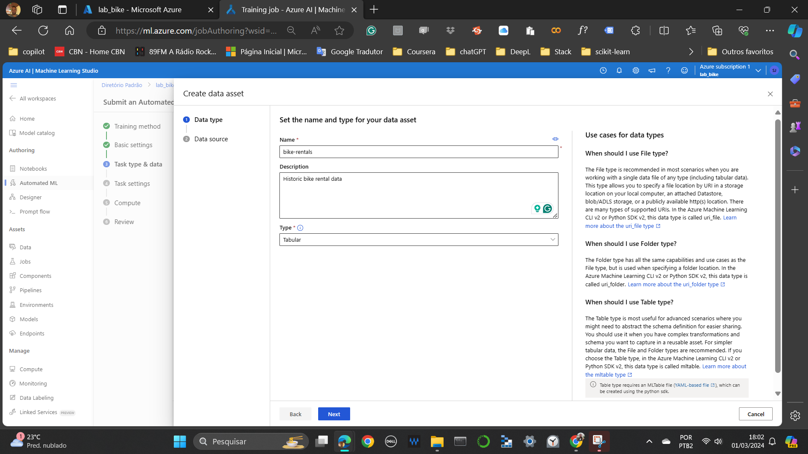
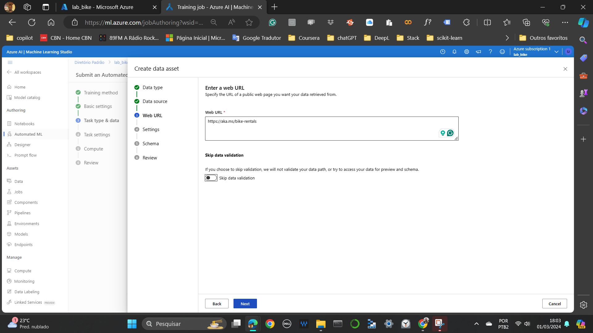
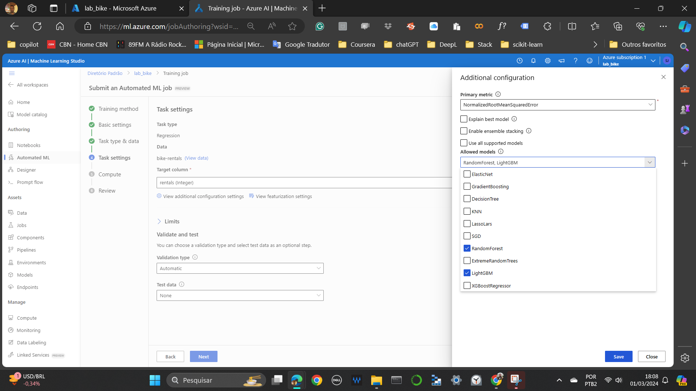
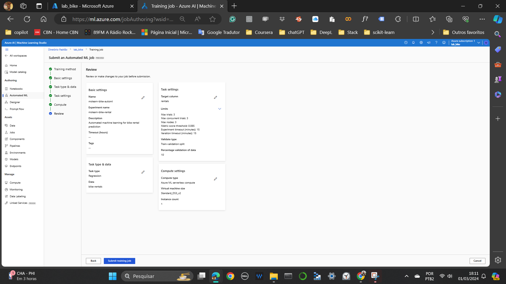
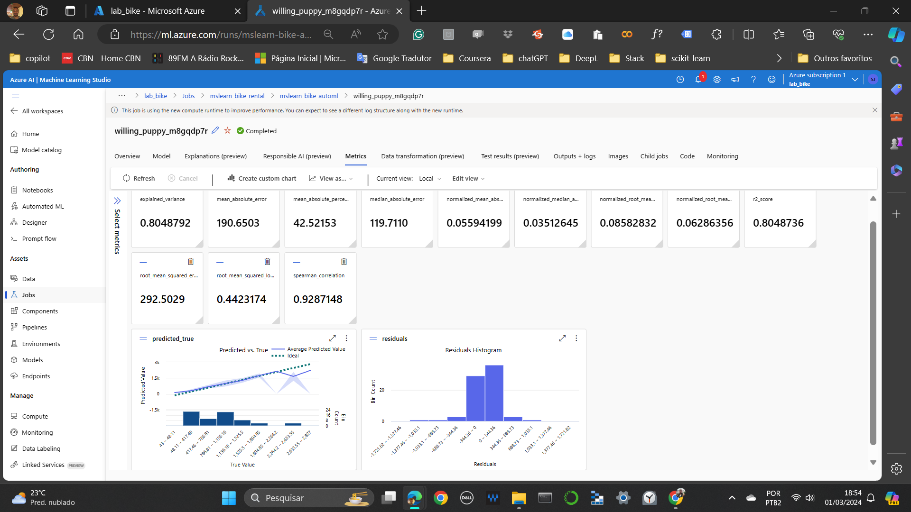
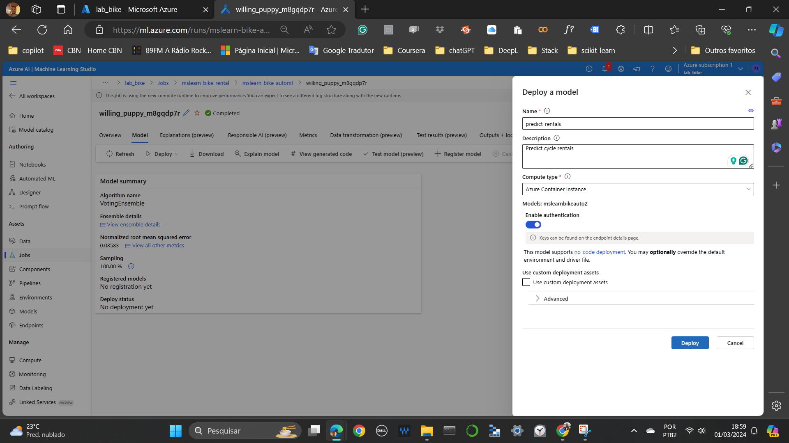

# azure_bikerentals_ML
## this exercise is part of the Microsoft Certified training track: Azure AI Fundamentals AI-900
### Automated machine learning for bike rental prediction
1 - After creating a workspace you need to create a job name
 

2 - The data is tabular and available at a web address. It is open data.

3 - The models chosen for regression are RandomForest and LightGBM

4 - Review

5 - Check the results by studying the metrics

6 - Deploy and test the model

7 - Test the deployed service

8 - Test result

